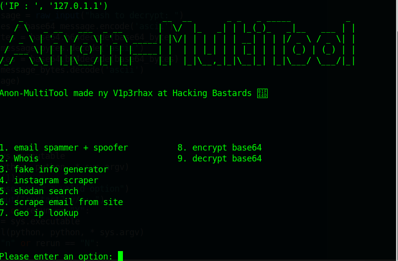

[
# Anon-MultiTool

# Email spammer + Spoofer 
  $ spoof the alias name (for complete anonymnity create an email with all fake info)
  $ Custom or generated spoof email
  $ Spams for sent amount                                                                                       
  $ can set interval for message to be sent (1-60 seconds)
# Whois
  $ Get info about a specified website
# Fake Info Generator
  $ Genereates fake Name, Email, and Address for when you need fake info but cant think of any realistic info (Email cant be used so use on site that does not require email verification)
# Instagram scraper
  $ Scrapes account info and posts
# Shodan Search
  # REQUIRES SHODAN API
  $ Search for webcams phones etc to view 
# Scrape Emails from site 
  $ scrapes emails from sites
# Geo IP LookUp
  # REQUIRES IPSTACK API
  $ Gets info from a specified IP address
# Encrypt base64                                                                                                   
  $ Encrypts given input as base64                                                                                  
# Decrypt base64                                                                                
  $ Decrypts given input                                                                                            
  AND MORE TO COME, Made By V1p3rhax at Hacking Bastards  
